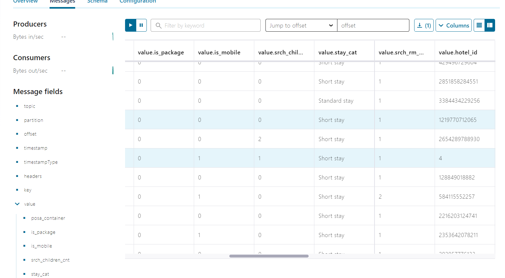
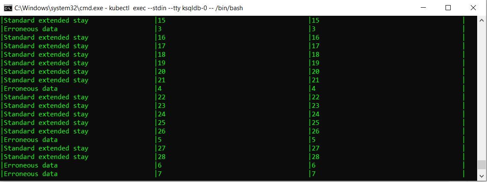

# Kafka connect in Kubernetes

## Deploy Azure resources using [Terraform](https://www.terraform.io/) (version >= 0.15 should be installed on your system)
```
terraform init
terraform plan -out terraform.plan
terraform apply terraform.plan
....
terraform destroy
```

## Install Confluent Hub Client

You can find the installation manual [here](https://docs.confluent.io/home/connect/confluent-hub/client.html)

## Create a custom docker image

For running the azure connector, you can create your own docker image. Create your azure connector image and build it.

## Launch Confluent for Kubernetes

### Create a namespace

- Create the namespace to use:

  ```cmd
  kubectl create namespace confluent
  ```

- Set this namespace to default for your Kubernetes context:

  ```cmd
  kubectl config set-context --current --namespace confluent
  ```

### Install Confluent for Kubernetes

- Add the Confluent for Kubernetes Helm repository:

  ```cmd
  helm repo add confluentinc https://packages.confluent.io/helm
  helm repo update
  ```

- Install Confluent for Kubernetes:

  ```cmd
  helm upgrade --install confluent-operator confluentinc/confluent-for-kubernetes
  ```

### Install Confluent Platform

- Install all Confluent Platform components:

  ```cmd
  kubectl apply -f ./confluent-platform.yaml
  ```

- Install a sample producer app and topic:

  ```cmd
  kubectl apply -f ./producer-app-data.yaml
  ```

- Check that everything is deployed:

  ```cmd
  kubectl get pods -o wide 
  ```

### View Control Center

- Set up port forwarding to Control Center web UI from local machine:

  ```cmd
  kubectl port-forward controlcenter-0 9021:9021
  ```

- Browse to Control Center: [http://localhost:9021](http://localhost:9021)

## Create a kafka topic

- The topic should have at least 3 partitions because the azure blob storage has 3 partitions. Name the new topic: "expedia".

## Prepare the azure connector configuration

## Upload the connector file through the API

## Implement you KStream application

- Add necessary code and configuration to [KStream Application Class](src/main/java/com/epam/bd201/KStreamsApplication.java)

- Build KStream application jar
  ```cmd
  $ mvn package
  ```

- Build [KStream Docker Image](Dockerfile) - insert valid Azure image registry here
  ```cmd
  $ docker build -t image-registry/your-project-id/kstream-app:1.0
  ```

- Push KStream image to Container Registry
  ```cmd
  $ docker push image-registry/your-project-id/kstream-app:1.0
  ```

- Run you KStream app container in the K8s kluster alongside with Kafka Connect. Don't forger to update [Kubernetes deployment](kstream-app.yaml)
  with valid registry for your image
  ```cmd
  $ kubectl create -f kstream-app.yaml
  ```
- You will see the result(expedia-ext topic)

- Then you can query the result
